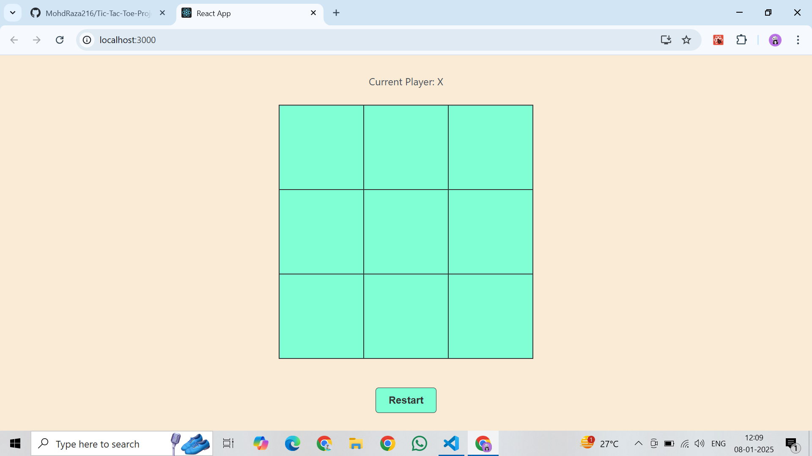
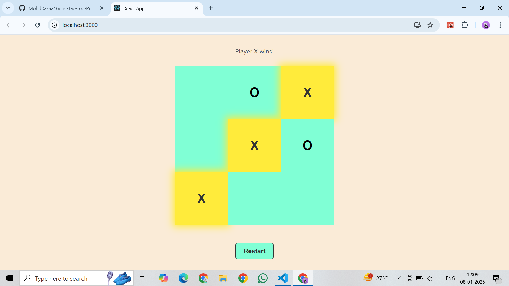
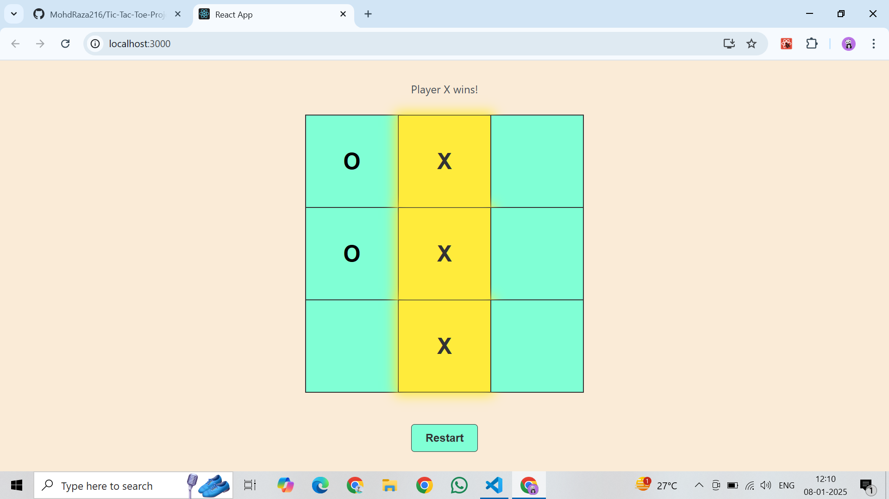

# Tic-Tac-Toe Game 🎮

A simple and interactive Tic-Tac-Toe game built with **React**. The game allows two players to take turns, detects winning conditions, highlights the winning combination, and supports restarting the game.

## Features ✨

- **Two-Player Gameplay**: Players alternate between "X" and "O".
- **Win Detection**: Highlights the winning combination when a player wins.
- **Draw Detection**: Alerts when the game ends in a draw.
- **Responsive Design**: Scales well across different screen sizes.
- **Restart Button**: Allows restarting the game anytime.

## Demo 🚀




## Installation 🛠️

1. Clone the repository:
   ```bash
   git clone https://github.com/MohdRaza216/tic-tac-toe-react.git
   cd tic-tac-toe-react
   ```

2. Install dependencies:
   ```bash
   npm install
   ```

3. Start the development server:
   ```bash
   npm start
   ```

4. Open the game in your browser:
   ```
   http://localhost:3000
   ```

## How to Play 🎲

1. The first player uses **"X"**, and the second player uses **"O"**.
2. Players take turns clicking on the squares to make their moves.
3. The game will:
   - Highlight the winning combination if someone wins.
   - Display a draw message if all squares are filled without a winner.
4. Use the **Restart** button to start a new game.

## Project Structure 📂

```
src/
├── components/
│   ├── Square.jsx
├── App.js        
├── App.css       
├── index.js      
```

## CSS Styling 🎨

- The `winning` class highlights the winning squares with a yellow glow.
- Fully responsive for different screen sizes.

## Dependencies 📦

- **React**: Frontend library
- **PropTypes**: For type-checking React props

## Roadmap 🛤️

- Add AI for single-player mode.
- Add score tracking for multiple rounds.
- Add more customization options like themes.

## Contributing 🤝

Contributions are welcome! To contribute:

1. Fork the repository.
2. Create a new branch:
   ```bash
   git checkout -b feature-name
   ```
3. Commit your changes:
   ```bash
   git commit -m "Add feature name"
   ```
4. Push to the branch:
   ```bash
   git push origin feature-name
   ```
5. Open a pull request.

## License 📝

This project is licensed under the MIT License. See the [LICENSE](./LICENSE) file for details.
